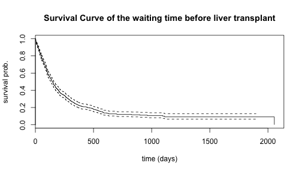
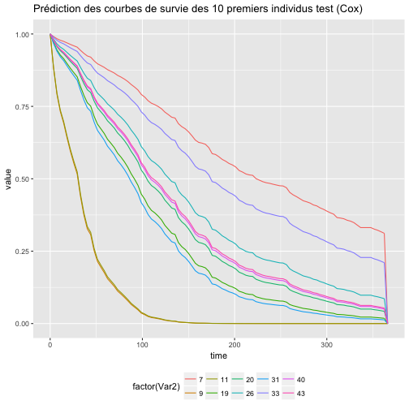

# Introduction to sword

## What is sword ?

`sword` is an experimental package which  provides a tool to generalise the use of the Random Forest algorithm and the Generalised Additive Model (GAM) model to the modeling of right censored data. Such models can be built very easily thanks to `sword`, and their performances can be compared with benchmark models.

Technically, sword is a wrapper for statistical algorithms provided in the R packages randomForestSRC (random forest : *rfsrc*), rpart, survival and mgcv (*gam*).

As `sword` is experimental, it is designed such that somebody interested in the method could test it and get results very fast on new data. However, `sword` is not numerically optimised and can not handle massive amount of data.

We point out that `sword` has more a research focus and one should be careful before making a professional use of it.

## Survival regression setting

To describe the general problem we study, let $T$ a time variable. It is well known that in some applications where the time of interest is a long duration, the time $T$ may not be fully observed due to the fact that $T$ may not have occured before the end of the study, or that the follow up of an individual may have stoped prematurely, before $T$ occured. We meet such situations in the study of lifetime, long term care insurance, predictive maintenance or contract churn. Indeed, in the case of lifetime for instance, part of the population is still alive at the time the study is made and the lifetimes of the living individuals are unknown : we know that their lifetimes ($T$) are bigger than their current ages but we don't know what will be their lifetimes (we know a partial information).

In this context, we then define $C$ the time of the end of the observation, caused by any reason (end of follow up, end of the study, ...) except death, and we say that $T$ is right censored by $C$. Instead of observing $T$, we observe $Y = \text{min}(T,C)$ and $\Delta = 1_{T \le C}$.

We note $X$ a vector of characteristics of an observation (e.g. for the study of lifetime : sex, education,..). Then our observations consists in $n$ independant and identically distributed replications of the vector $(Y, \Delta, X)$. We note $(Y_i, \Delta_i, X_i)_{i=1,..,n}$ the random variables, and $(y_i, \delta_i, x_i)_{i=1,..,n}$ the corresponding observations.

In some situations, one may be interested in predicting $\phi(T)$ (for a given function $\phi$) rather than predicting $T$. We give an example of this situation in the article [??] where $T$ corresponds to the termination time of an insurance contract and $\phi(T)$ denotes the amount of commission received by the broker which sold the contract. In the following, we study another example where $\phi(T) = 1_{T > 365}$ and we focus on predicting the probability that the waiting time before a patient benefit from a liver transplantation exceed one year.

The packages `sword` answers the problem of the prediction of $\phi(T)$, providing functions to build models that aims to estimate $E[\phi(T)|X]$.

## Weighted method for the regression of a right censored variable

### Inverse Probability of Censoring Weighting (IPCW)

The main function of `sword` is the function `weighted_regression_survival` : this function allows to fit random forest and GAM (Generalised additive model) models to a right censored variable, using Inverse Probability of Censoring Weighting (IPCW). The idea behind the IPCW method is that the non censored observations of $T$ : $(y_i)_{i \in \{i = 1,..n / \delta_i = 1\}}$, are biased downwards since they are realisations of the variable $T | T \le C$. But it is possible to compensate the bias induced by the censoring thanks to a correct weighting.

If we assume $(H)$ that $T$ and $C$ are independent conditinally on $X$, then we can show that we have the following equality :

$$E\left[ W \cdot \psi(Y,X) \right] = E \left[\psi(T,X)\right] ,~~ \text{with} ~~ W = \frac{\Delta}{S_C(Y |X)}$$

with $S_C(t ~| X = x)$ denoting the survival function of $C$ given that $X = x$, and $\psi$ a given function.

This equality shows that it is possible to estimate the distribution of $(T,X)$ from the available censored observations $(y_i, \delta_i, x_i)_{i=1,..,n}$. To do so, each observation $(y_i, x_i)$ is weighted as follow :

* $w_i = 0$ if $\delta_i = 0$ ($T_i$ is censored)
* $w_i = 1 ~/~ S_C(y_i |X = x_i)$ if $\delta_i = 0$ ($y_i = t_i$ and $T_i$ is not censored)

Remark: we have $S_C(t_i |X = x_i) = P(C > t_i | X = x_i)  \overset{(H)}{=} P(C > T | X = x_i, T = t_i)$. Then we observe that the quantity $S_C(t_i |X = x_i)$ corresponds to a probability of being non censored. Hence the name IPCW.

By attributing weights $w_i$ to the observations, `weighted_regression_survival` generalises classical regression algorithms to the right censored case.

### Practical algorithms

In practice, the function $S_C(\cdot |X = x)$ is unknown and so are the weights $w_i$. Then we should estimate $S_C(\cdot |X = x)$ in order to use the IPCW principle. There are 3 methods implemented in `weighted_regression_survival` to estimate $S_C(\cdot |X = x)$ (`type_weights` argument) :

- `"KM"` : Kaplan Meier estimator (it makes the stonger assumption that $(T,X)$ and $C$ are independent),
- `"Cox"` : Cox model,
- `"RSF"` : Random Survival Forest.

Once we have built an estimator $\hat{S}_C(\cdot |X = x)$ of $S_C(\cdot |X = x)$, we can compute the IPC weights $\hat{w}_i = \delta_i ~/~ \hat{S}_C(y_i |X = x_i)$.

Then the method consists in using the regression algorithm to predict the targets $\phi(y_i)$, with explanatory variables $x_i$, and with each observation $i$ getting a weight $\hat{w}_i$ in the model training. 

Depending on the algorithm, there might be different ways to take the weights into account. For instance, if we consider a linear gaussian model (with parameter $\beta$) as regression algorithm, the weights $\hat{w}_i$ are introduced in the quadratic error of the model and $\hat{\beta}$ is estimated with :

\begin{align*}
\hat{\beta} = \underset{\beta \in R^d}{\text{argmin}} \sum_{i=1}^n \hat{w}_i \cdot (\phi(y_i) - \beta \cdot x_i)
\end{align*}


# Example data : Liver transplant waiting time

We now illustrate through an example how the package `sword` can be used to model right censored data. We use the dataset called `transplant` which records, from 1990 to 1999, information about the patients which were on a waiting list for receiving a transplant.

## Load and preprocess the data


```r
library(sword)
library(ggplot2)
library(reshape2)
```


```r
data("transplant")
head(transplant)
#>   age sex abo year futime    event
#> 1  47   m   B 1994   1197    death
#> 2  55   m   A 1991     28      ltx
#> 3  52   m   B 1996     85      ltx
#> 4  40   f   O 1995    231      ltx
#> 5  70   m   O 1996   1271 censored
#> 6  66   f   O 1996     58      ltx
```

In this dataset, the variable `futime` corresponds to the $Y$ variable defined in the previous paragraph (time from entry in the list to the exit of the list fo rany reason) and `event` corrresponds to $\Delta$. A small difference is that in the `transplant` dataset there are 4 outcomes for the `event` taking place at the end of the `futime` period (`censored`, `death`, `ltx` : liver transplant, or `withdraw`) whereas in our setting there are only two possible outcomes : ocurrence of $T$ or censoring (end the observation : $C$). For the purpose of the example, we reduce the problem studied here in a problem with a binary outcome by condidering the event `delta` : did the person receive a transplant ? yes : `1` (`ltx` modality) or no : `0` (`censored`, `death`, `withdraw` modalities). As a result, we study the distribution of the variable "waiting time from the entry in the list until transplantation".


```r
transplant$delta = 1 * (transplant$event == "ltx") # create binary variable which indicate censoring/non censoring
```

Four covariates (vector $X$) are provided :

* `age` : age at entry in the waiting list
* `sex`
* `abo` : blood type : `A`, `B`, `AB` or `O`
* `year` : year of entrance in the waiting list


```r
# compute the number of missing values for each column
apply(transplant, MARGIN = 2, FUN = function(x){sum(is.na(x))})
#>    age    sex    abo   year futime  event  delta 
#>     18      0      0      0      0      0      0

# keep only rows with no missing value
transplant_bis = transplant[complete.cases(transplant),]
```

## Statistics about the data (Survival function of the outcome)


```r
# plot the survival curve of the waiting time until transplant
KM = survfit(formula = Surv(time = futime, event = delta) ~ 1,
                        data = transplant_bis)
plot(KM, 
     main = "Survival Curve of the waiting time before liver transplant", 
     ylab = "survival prob.", xlab = "time (days)")
```




# Predict the probability that a transplantation occurs after more than one year of waiting

In this application we take $\phi(t) = 1_{t > 365}$ so that our goal is to estimate $P(T > 365~|~X)$. 

We split the dataset into train and test sets so that we can validate our model :


```r
nrow(transplant_bis) # number of observations
#> [1] 797

set.seed(17)
train_lines = sample(1:nrow(transplant_bis), 600)
train = transplant_bis[train_lines,] # train set
test = transplant_bis[-train_lines,] # test set
```

In this special case the value of $\phi(T)$ is known as soon as $T$ reaches 366 days : we can set $T' = \text{min}(T, 366)$ and we have $\phi(T') = \phi(T)$. Then we can replace $\phi(T)$ by $\phi(T')$ ; the advantage is that $T' \le T$, then $T'$ is less censored than $T$ and we get more non censored observations, resulting in a more accurate estimation. This is the purpose of the `max_time` argument of the function `weighted_regression_survival` which allows to replace $T$ by $T'= min(T,$ `max_time`).

## Weighted Regression Survival

### Train a weighted random forest model

By default, the `type_regression` argument of `weighted_regression_survival` takes the values `"RF"`, which means the regression algorithm used by the function is the random forest. The other possible value is `"gam"`. Then, the following command train a weighted random forest model on the transplant data :


```r
res1 = weighted_regression_survival(y_var = "futime", 
                                    delta_var = "delta",
                                    x_vars = c("age", "sex", "abo", "year"),
                                    data_train = train,
                                    data_test = test,
                                    type_weights = "KM",
                                    phi = function(x){(x > 365) * 1},
                                    max_time = 366,
                                    types_weights_eval = c("KM", "Cox", "RSF", "unif"))
```

The `type_weights` argument specifies the type of weights to use in the model training, among `"KM"`, `"Cox"` and `"RSF"` (see part. ??, default = `"KM"`). The other possible value is `"unif"` which corresponds to every non censored observations getting the same weight (and censored obs. getting weights 0) : this value is not recommended since it generally leads to highly biased results, but it can be tested.

Due to the `max_time` argument, the rate of censoring in the training data is different from the rate of censoring in the initial data :


```r
print(sum(train$delta == 0) / nrow(train)) # rate of censoring on the initial data
#> [1] 0.2283333
print(head(res1$censoring_rate_with_threshold)) # rate of censoring after thresholding with `max_time`
#> [1] 0.1254705
```

The training weights, which are in the above example computed with the `"KM"` method, are returned by the function :


```r
print(res1$v_weights_model_train[1:30])
#>  [1] 0.002185784 0.002185784 0.001802074 0.001807359 0.001731829
#>  [6] 0.002036441 0.001876524 0.000000000 0.002185784 0.001738812
#> [11] 0.001788555 0.001721746 0.002185784 0.001731829 0.000000000
#> [16] 0.000000000 0.002185784 0.001696026 0.000000000 0.001921689
#> [21] 0.002185784 0.001802074 0.002112170 0.001883605 0.000000000
#> [26] 0.001686853 0.001890934 0.002036441 0.002185784 0.001792949
```

The parameter `max_ratio_weights_model` may also be specified in the model training (`default value = 20`). The purpose of this parameter is to limit the ratio $\max(\hat{w}_i) / \min(\hat{w}_i)$ to the value 
`max_ratio_weights_model`. When needed, the weights $\hat{w}_i$ that exceed `max_ratio_weights_model`$* \min(\hat{w}_i)$ are set to the value : `max_ratio_weights_model`$* \min(\hat{w}_i)$. Afterwards, the weights $(\hat{w}_i)$ are normalised such that they sum to $1$.


```r
print(res1$max_ratio_weights_model) # value passed to the weighted_regression_survival function (default value = 20)
#> [1] 20
print(max(res1$v_weights_model_train) / min(res1$v_weights_model_train[res1$v_weights_model_train > 0])) # maximum ratio among the train weights
#> [1] 1.307099
print(res1$n_weights_model_modif_train) # number of weights modified due to `max_ratio_weights_model`
#> [1] 0
```

In our example, as the rate of censoring is low and the values of $T$ are thresholded by $366$, the weights don't take big values and the parameter `max_ratio_weights_model` has no effect. But in some cases where the rate of censoring is high and/or `max_time` isn't specified, the weighs $\hat{w}_i$ can take very big values. When it happens, il should be corrected because the importance of a single observation in the final model must be limited : otherwise this results in very high variance in the final model.


### Predictions of the model

The predictions given by the model on the train and the test sets are available in the returned object :


```r
print(head(res1$predicted_train))
#> [1] 0.571513783 0.507620524 0.002034131 0.011968027 0.024799850 0.526557553
print(head(res1$predicted_test))
#> [1] 0.273462102 0.005632639 0.001075059 0.076765117 0.038575076 0.021048235
```

It is often needed to compute the predictions of the model on new data and the function `predict_weighted_regression_survival` allows to do so :


```r
pred_test = predict_weighted_regression_survival(object = res1, newdata = test)
print(pred_test$predicted[1:30])
#>  [1] 2.734621e-01 5.632639e-03 1.075059e-03 7.676512e-02 3.857508e-02
#>  [6] 2.104823e-02 3.295637e-03 3.454207e-02 3.157306e-02 1.832189e-02
#> [11] 6.184659e-03 4.410611e-01 5.420728e-02 1.449400e-01 4.101022e-01
#> [16] 1.035051e-02 4.794045e-01 1.223946e-03 8.550815e-02 3.440471e-03
#> [21] 1.223946e-03 9.170184e-03 7.762210e-02 6.351726e-01 1.342741e-02
#> [26] 3.297248e-02 1.633171e-02 4.174354e-01 4.759153e-01 6.849315e-05
```


### Assess the quality of fit of the model


The `type_weights_eval` argument has the same set of possible values as `type_weights`, but multiple choices are possible. This argument gives the names of the weights that should be considered for the calculation of the mean squared error (MSE) estimator. Indeed, we have that, likewise for the model training, the right censoring should be compensate in the test sample. We then use the same IPCW technique as for the training and the MSE is evaluated with :

$$MSE = \frac{1}{n_{test}} \sum_{i = 1}^{n_{test}} \hat{w}_i \cdot (\phi(y_i) - pred_i)^2$$

where $pred_i$ is the prediction made by the model.

Goodness of fit statistics on the test set are accessible through the `list_criteria_test` element of the returned object :


```r
print(res1$list_criteria_test$criteria_weighted) # test mse and R2
#>    KM_mse     KM_R2   Cox_mse    Cox_R2   RSF_mse    RSF_R2  unif_mse 
#> 0.1238537 0.2229525 0.1232588 0.2277090 0.1257881 0.2062063 0.1127530 
#>   unif_R2 
#> 0.2097894
```

We observe that we get one MSE for each type of weights specified in the `types_weights_eval` argument. 

We also get the $R2$ criteria which are normalisations of the MSE. Let :

$$ \hat{Mean} = \frac{1}{n_{test}} \sum_{i = 1}^{n_{test}} \hat{w}_i \cdot \phi(y_i)$$

and

$$ \hat{Var} = \frac{1}{n_{test}} \sum_{i = 1}^{n_{test}} \hat{w}_i \cdot (\phi(y_i) - \hat{Mean})^2 $$

Then $R2 = 1 - MSE ~/~ \hat{Var}$.

The classical concordance index (or C-index) is provided :


```r
print(res1$list_criteria_test$concordance)
#> concordant 
#>  0.7441038
```

These performance criteria are also computed on the train set :


```r
print(res1$list_criteria_train)
#> $concordance
#> concordant 
#>  0.8340606 
#> 
#> $criteria_weighted
#>     KM_mse      KM_R2    Cox_mse     Cox_R2    RSF_mse     RSF_R2 
#> 0.08453915 0.53418672 0.08445106 0.53211002 0.08325215 0.53437152 
#>   unif_mse    unif_R2 
#> 0.07906565 0.52074750
```


The weights used to evaluate the model are accessible through :


```r
# weights used for evaluation
print(head(res1$mat_weights_train))
#>               KM         Cox         RSF        unif
#> [1,] 0.002185784 0.002287308 0.002063324 0.001912046
#> [2,] 0.002185784 0.002119006 0.001995112 0.001912046
#> [3,] 0.001802074 0.001845550 0.001832967 0.001912046
#> [4,] 0.001807359 0.001872151 0.001775351 0.001912046
#> [5,] 0.001731829 0.001789211 0.001709707 0.001912046
#> [6,] 0.002036441 0.001946162 0.001965594 0.001912046
print(head(res1$mat_weights_test))
#>               KM         Cox         RSF        unif
#> [1,] 0.006632843 0.006253090 0.006174551 0.005747126
#> [2,] 0.005129246 0.005113647 0.005051521 0.005747126
#> [3,] 0.005129246 0.005113067 0.005017589 0.005747126
#> [4,] 0.005089125 0.005087231 0.005013520 0.005747126
#> [5,] 0.000000000 0.000000000 0.000000000 0.000000000
#> [6,] 0.005979022 0.005500810 0.005683825 0.005747126
```


Likewise for the weights used for training, the ratio between the evaluation weights may be limited to a certain value (common for all the types of weights). This is specified by the argument `max_ratio_weights_eval`.


```r
print(res1$max_ratio_weights_eval) # value passed to the weighted_regression_survival function (default value = 1000)
#> [1] 1000
print(res1$n_weights_eval_modif_test) # number of test weights modified because of the threshold
#>   KM  Cox  RSF unif 
#>    0    0    0    0
print(res1$n_weights_eval_modif_train) # number of train weights modified because of the threshold
#>   KM  Cox  RSF unif 
#>    0    0    0    0
```


The outputs `sum_weights_train` and `sum_weights_test` returns the sum of the weights $\hat{w}_i$ before any thresholding is done on the weights. This value is normally closed from 1. A value far from 1 may indicate a bad fit for the model which estimates $S_C(\cdot | X)$.


```r
print(res1$sum_weights_train) # sum of the train weights before reprocessing
#>       KM      Cox      RSF     unif 
#> 1.000000 1.000195 1.006768 1.000000
print(res1$sum_weights_test) # sum fo the test weighs before reprocessing
#>       KM      Cox      RSF     unif 
#> 0.999987 1.000778 1.012947 1.000000
```


### other mode for weighted random forest


```r
res2 = weighted_regression_survival(y_var = "futime",
                                    delta_var = "delta",
                                    x_vars = c("age", "sex", "abo", "year"),
                                    data_train = train,
                                    data_test = test,
                                    type_weights = "KM",
                                    phi = function(x){(x > 365) * 1},
                                    max_time = 366,
                                    types_weights_eval = c("KM", "Cox", "RSF", "unif"),
                                    mode_w_RF = 2)
#> tree1.. tree2.. tree5.. tree10.. tree20.. tree30.. tree40.. tree50.. tree60.. tree70.. tree80.. tree90.. tree100..
```


```r
print(res2$list_criteria_test)
#> $concordance
#> concordant 
#>  0.7062369 
#> 
#> $criteria_weighted
#>    KM_mse     KM_R2   Cox_mse    Cox_R2   RSF_mse    RSF_R2  unif_mse 
#> 0.1272653 0.2015484 0.1267140 0.2060598 0.1286473 0.1876447 0.1161002 
#>   unif_R2 
#> 0.1863313
print(res2$list_criteria_test_KMloc)
#> $concordance
#> concordant 
#>  0.7342767 
#> 
#> $criteria_weighted
#>    KM_mse     KM_R2   Cox_mse    Cox_R2   RSF_mse    RSF_R2  unif_mse 
#> 0.1259114 0.2100428 0.1254294 0.2141084 0.1272064 0.1967431 0.1145549 
#>   unif_R2 
#> 0.1971609
```

### weighted GAM model

The `weighted_regression_survival` may also be used to fit Generalized Additive Model (GAM) on survival data by specifying `type_regression = "gam"` in the function call. Here, we train a GLM model with *binomial* distribution and link *logit* on the data :


```r
res2 = weighted_regression_survival(y_var = "futime", 
                                    delta_var = "delta",
                                    x_vars = c("age", "sex", "abo", "year"),
                                    data_train = train,
                                    data_test = test,
                                    type_regression = "gam",
                                    type_weights = "Cox",
                                    phi = function(x){(x > 365) * 1},
                                    max_time = 366,
                                    types_weights_eval = c("KM", "Cox", "RSF", "unif"),
                                    family = binomial(link = "logit"))
#> Warning in eval(family$initialize): non-integer #successes in a binomial
#> glm!

#> Warning in eval(family$initialize): non-integer #successes in a binomial
#> glm!
```
IPC weights are computed using the Cox model (`type_weights = "Cox"`). The gam object is returned by the function :


```r
summary(res2$weighted_gam_object)
#> 
#> Family: binomial 
#> Link function: logit 
#> 
#> Formula:
#> phi ~ age + sex + abo + year
#> 
#> Parametric coefficients:
#>               Estimate Std. Error z value Pr(>|z|)
#> (Intercept) -1.762e+03  4.469e+03  -0.394    0.693
#> age          1.196e-02  3.194e-01   0.037    0.970
#> sexf        -2.520e-02  6.021e+00  -0.004    0.997
#> aboB         9.230e-02  1.001e+01   0.009    0.993
#> aboAB       -1.879e-01  1.488e+01  -0.013    0.990
#> aboO         1.508e+00  6.913e+00   0.218    0.827
#> year         8.811e-01  2.237e+00   0.394    0.694
#> 
#> 
#> R-sq.(adj) =  0.346   Deviance explained = 34.6%
#> UBRE = -0.97186  Scale est. = 1         n = 523
```

The fit appears to be poor because the p-values of the coefficients are high. The following scores confirm the fit of the GLM (binomial) model is not good.


```r
print(res2$predicted_test[1:20])
#>            7            9           11           19           20 
#> 0.3237898409 0.0004748132 0.0005224648 0.0112900705 0.0378299939 
#>           26           31           33           40           43 
#> 0.0399378897 0.0178189523 0.1576255233 0.0361711032 0.0348577552 
#>           44           46           47           54           55 
#> 0.0005040597 0.7473148696 0.0027466010 0.2012872892 0.5606590893 
#>           56           59           60           62           69 
#> 0.0014132901 0.3016860921 0.0005217981 0.0348148005 0.0004856820
print(res2$list_criteria_test)
#> $concordance
#> concordant 
#>  0.7041405 
#> 
#> $criteria_weighted
#>    Cox_mse     Cox_R2     KM_mse      KM_R2    RSF_mse     RSF_R2 
#> 0.15062742 0.05622762 0.15073683 0.05429012 0.15015030 0.04216128 
#>   unif_mse    unif_R2 
#> 0.13818333 0.03156517
```


### Modify the arguments of the internal regression algorithm used

Both the random forest algorithm and the GAM model can benefit from the adjustment of different parameters. For the random forest, the most common parameters are :

- ntree : number of tree grown in the forest,
- maxdepth : maximum aurotised depth in single trees. The depth of a tree is the lenght of the longuest path from the original node of the tree to the terminal leafs,
- minleaf : minimum number of observations that should be present in a terminal leaf,
- mtry : number of variables drawn uniformly at each node, to look for the best split.

Those four parameters are available as parameters of the `weighted_regression_survival` function. But many other parameters can be pass to the *randomForestSRC::rfsrc* function of the package , or the *rpart::rpart* function. 
In fact, any parameter of the wrapped function can be specified through a call to `weighted_regression_survival`, thanks to the argument `...`. For instance, one can add `proximity = TRUE` when calling to `weighted_regression_survival` (`type_regression = "rf"`, `mode_w_RF = 1`) and the argument will be pass to the function *randomForestSRC::rfsrc* :


```r
res11 = weighted_regression_survival(y_var = "futime", 
                                    delta_var = "delta",
                                    x_vars = c("age", "sex", "abo", "year"),
                                    data_train = train,
                                    data_test = test,
                                    type_weights = "KM",
                                    phi = function(x){(x > 365) * 1},
                                    max_time = 366,
                                    types_weights_eval = c("KM", "Cox", "RSF", "unif"),
                                    proximity = T)
```


```r
print(res11$weighted_RF_object$proximity[1:5,1:5]) # matrix of the proximities between the first 5 obs. of the train set
#>            [,1]  [,2]       [,3]      [,4]      [,5]
#> [1,] 1.00000000 0.225 0.02380952 0.0000000 0.0000000
#> [2,] 0.22500000 1.000 0.00000000 0.0000000 0.0000000
#> [3,] 0.02380952 0.000 1.00000000 0.4444444 0.4242424
#> [4,] 0.00000000 0.000 0.44444444 1.0000000 0.2307692
#> [5,] 0.00000000 0.000 0.42424242 0.2307692 1.0000000
print(dim(res11$weighted_RF_object$proximity)) # dimension of the proximity matrix
#> [1] 523 523
```

For the *mgcv::gam* function, no additionnal parameter figure in the list of the arguments of `weighted_regression_survival`. Every parameter should be pass thanks to `"..."`. We did in the previous paragraph to specify `family = binomial(link = "logit")` in the gam model.


## Comparison with benchmark models

The two benchmark models we use are derived from 2 classical algorithms to study survival data : the Cox model and the random survival forest algorithm. In both cases, the survival model is used to build a model to estimate the conditionnal survival functions $S_T(\cdot,X = x)$ : let $\hat{S} _T(\cdot,X = x)$ the estimates. Then, the prediction for $E[\phi(T)|X=x]$ is estimated with the formula

\begin{align*}
\hat{\phi} = - \int_{s=0}^{\text{max_time}} \phi(s) d\hat{S}_T(\cdot,X = x)
\end{align*}

### Random Survival Forest


```r
res2 = RSF_regression(y_var = "futime",
                      delta_var = "delta",
                      x_vars = c("age", "sex", "abo", "year"),
                      data_train = transplant_bis[train_lines,],
                      data_test = transplant_bis[-train_lines,],
                      phi = function(x){(x > 365) * 1},
                      max_time = 366,
                      types_weights_eval = c("KM", "Cox", "RSF", "unif"))
```

For the first 10 observations of the test set, we draw the predicted survival curves :

```
dpi=300
```

```r
data_surv_test = cbind(melt(t(res2$survival_test[1:10,])), time = res2$time_points)
ggplot(data = data_surv_test, 
       aes(x = time, y = value, group = factor(Var2), color = factor(Var2))) +
  geom_line() +
  theme(legend.position = "bottom") +
  ggtitle("Prédiction des courbes de survie des 10 premiers individus test (RSF)")
```


Observe that we don't estimate the survival curves beyond `max_time`, since these estimates would be useless.

These survival curves correspond to the following predictions in terms of $\phi$ ($\phi(t) = 1_{t > 365}$):


```r
res2$predicted_test[1:10]
#>  [1] 0.34776355 0.07026781 0.08123179 0.05848006 0.04959919 0.07497374
#>  [7] 0.02730424 0.04859462 0.04462842 0.04919866
```

We have the same quality of fit criteria as for the function `weighted_regression_survival` :


```r
print(res2$list_criteria_test)
#> $concordance
#> concordant 
#>  0.7267427 
#> 
#> $criteria_weighted
#>    KM_mse     KM_R2   Cox_mse    Cox_R2   RSF_mse    RSF_R2  unif_mse 
#> 0.1292318 0.1892108 0.1290453 0.1914526 0.1310161 0.1742837 0.1177548 
#>   unif_R2 
#> 0.1747349
```


### Cox model


```r
res3 = Cox_regression(y_var = "futime",
                      delta_var = "delta",
                      x_vars = c("age", "sex", "abo", "year"),
                      data_train = transplant_bis[train_lines,],
                      data_test = transplant_bis[-train_lines,],
                      phi = function(x){(x > 365) * 1},
                      max_time = 366,
                      types_weights_eval = c("KM", "Cox", "RSF", "unif"))
```


```r
data_surv_test2 = cbind(melt(t(res3$survival_test[1:10,])), time = res3$time_points)
ggplot(data = data_surv_test2, 
       aes(x = time, y = value, group = factor(Var2), color = factor(Var2))) +
  geom_line() +
  theme(legend.position = "bottom") +
  ggtitle("Prédiction des courbes de survie des 10 premiers individus test (Cox)")
```




```r
print(res3$list_criteria_test)
#> $concordance
#> concordant 
#>  0.7033543 
#> 
#> $criteria_weighted
#>    KM_mse     KM_R2   Cox_mse    Cox_R2   RSF_mse    RSF_R2  unif_mse 
#> 0.1381558 0.1332224 0.1379455 0.1356879 0.1386536 0.1226918 0.1260125 
#>   unif_R2 
#> 0.1168624
```

### Comparison of the results

In this example where the goal is to predict the probabily that the waiting time until leaver transplant exceeeds 1 year, we have seen that the weighted random forest approach achieve the best accuracy among the different model, followed closely by the Random Survival Forest benchmark. 

The advantage of the weighted random forest compared to the other models is that it focus on optimising the criteria that we want to minimise, which is the quadratic error measured on the test set. On the other hand, the information processed by `weighted_regression_survival` is different from the information processed by a benchmark (`RSF_regression` for example). Indeed, `weighted_regression_survival` processes the information $(\phi(y_i), x_i, \hat{w}_i)_{i=1,..,n}$ whereas `RSF_regression` processes the data $(y_i, \delta_i, x_i)_{i=1,..n}$. Since, $\phi$ is an indicator function, `weighted_regression_survival` doesn't see the difference between the uncensored observations $(y_i = 370, \delta_i = 1, x_i = ..)$ and $(y_i = 900, \delta_i = 1, x_i = ..)$ whereas `RSF_regression` does make the difference.

We have compared `weighted_regression_survival` and the benchmarks on many datasets, and though there is no general rule that would identify the best model, there are some facts that we can highlight from the experiments. First, `weighted_regression_survival` appears to perform well when the censoring rate is low (less than 30%), and not very well when the rate of censoring increases. We think that this can be explained by the fact that `weighted_regression_survival` is really a generalisation of the classical random forest algorithm (for regression) to the right censored case. Hence, as the censoring rate gets low, we get closer from the case where there is no censoring, and `weighted_regression_survival` behaves similarly as the random forest in the uncensored case. Second, the $\phi$ function that is considered seems to have a big influence on the results. Finally, the weighted apprach of the function `weighted_regression_survival` seems to work better with conditionnal weights computed with Cox or RSF, than with Kaplan-Meier weights. But the latter observation does not appear in the experiments with the `transplant` data because the censoring rate of this dataset is too low (then the difference is very small between weights `KM` and the conditionnal weights).

We have also observed that the predictions obtained with `weighted_regression_survival` and the predictions made with benchmarks are not correlated a lot, and that combining them usually leads to better accuracy


```r
# là j'ai calculé le R2 du modele qui est la moyenne entre weighted rf et RSF, mai visiblement pas ouf (trop de variance dans les résultats de tte façon)
mean = sum( res1$mat_weights_test[,"KM"] * res1$data_test$phi)
R2 = 1 - sum( res1$mat_weights_test[,"KM"] * ((res1$predicted_test + res2$predicted_test)/2 - res1$data_test$phi )^2) / 
  sum( res1$mat_weights_test[,"KM"] * (res1$data_test$phi - mean )^2)

print(mean)
#> [1] 0.1989853
print(R2)
#> [1] 0.2130927
```

# Conclusion

In this document, we have presented the package `sword` which aims to provide an implementation of the weighted regression algorihtm for survival data, that we have studied in the article [??]. To illustrate the fonctionalities of the package, we have explored the `transplant` data and we have applied the methods provided in `sword` to answer the problem of the estimation of the probabilty that a patient remain in the waiting list for liver transplant one year after entering the list.
